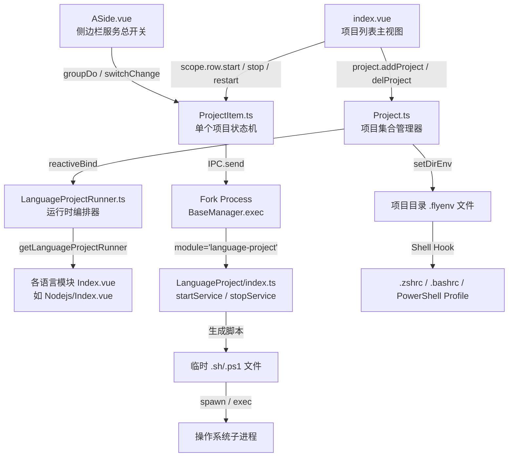

# LanguageProjects Deep Dive

> **模块类型**: 语言项目运行时管理器（非传统常驻服务，无 Base 继承链）
> **模块标识**: `language-project`
> **继承基类**: 无（独立类 `LanguageProject`，通过 `BaseManager` 动态加载）
> **分析日期**: 2026-04-22

---

## Overview

LanguageProjects 是 FlyEnv 中用于管理**多语言运行时项目**（Node.js、Python、Go、Rust、Java、PHP、Ruby、Erlang、Deno、Bun、Perl、Zig 等）的模块化基础设施。它不是一个传统意义上的"服务模块"（如 Nginx/MySQL 那样继承 `Base` 类并管理单一二进制守护进程），而是一套**项目级运行时编排系统**：

- 每个项目绑定一个独立目录、一个可选的语言版本（`binBin`）、一组环境变量和启动命令
- 核心痛点解决：在多版本语言环境中，不同项目依赖不同运行时版本，传统全局 PATH 会导致版本冲突
- 通过**项目目录级 `.flyenv` 文件 + Shell 钩子（chpwd/Prompt）+ 白名单目录校验**的三层机制，实现"进入项目目录即自动切换环境"的隔离效果
- 启动时通过 Fork 进程的 `customerServiceStartExec`/`customerServiceStartExecWin` 生成临时 Shell 脚本，在子进程中注入隔离后的 PATH 与环境变量

Sources: `src/fork/module/LanguageProject/index.ts:1-313`, `src/render/components/LanguageProjects/Project.ts:1-281`, `src/render/core/LanguageProjectRunner.ts:1-239`

---

## Architecture & State Management

### 组件层次结构



### 状态同步机制

LanguageProjects 采用**前端 Reactive 状态主导**的模型，与 Fork 进程之间是单向触发 + 回调确认，无持续状态同步：

1. **Vue 响应式状态**：`ProjectItem._state`（`{ running, isRun, pid }`）通过 `reactive()` 创建，UI 直接绑定
2. **IPC 触发**：`ProjectItem.start()` 调用 `IPC.send('app-fork:language-project', 'startService', ...)`，立即进入 `running = true`
3. **Fork 回调**：`LanguageProject.startService()` 执行完毕后通过 `ProcessSendSuccess` 返回结果，前端更新 `isRun` 和 `pid`
4. **无心跳检测**：停止后 PID 清空，运行中不轮询进程状态，依赖用户手动重启或停止

Sources: `src/render/components/LanguageProjects/ProjectItem.ts:66-85`, `src/render/core/LanguageProjectRunner.ts:57-76`, `src/fork/BaseManager.ts:72-114`

---

## Core Data Models

### `ProjectItemType`（前端运行时模型）

```typescript
export type ProjectItemType = {
  id: string
  path: string                    // 项目根目录（隔离边界）
  comment: string
  binVersion: string              // 选中的语言版本号
  binPath: string                 // 语言运行时安装目录
  binBin: string                  // 可执行文件绝对路径（如 /opt/php/8.3/bin/php）
  isService: boolean              // 是否作为常驻服务运行
  runCommand: string              // 启动命令（commandType='command' 时生效）
  runFile: string                 // 启动脚本路径（commandType='file' 时生效）
  commandType: 'command' | 'file'
  projectPort: number             // 服务监听端口（仅 isService=true）
  configPath: Array<{ name: string; path: string }>
  logPath: Array<{ name: string; path: string }>
  pidPath: string                 // PID 文件路径（用于 waitPidFile 检测）
  isSudo: boolean                 // 是否需要 root 权限启动
  envVarType: 'none' | 'specify' | 'file'
  envVar: string                  // 直接填写的环境变量（KEY=VAL 格式）
  envFile: string                 // 环境变量文件路径
  runInTerminal: boolean          // 是否在系统终端中打开
}
```

### `RunProjectItem`（IPC 传输模型）

```typescript
export type RunProjectItem = ProjectItemType & {
  typeFlag: string                // 语言标识：nodejs/python/golang/...
}
```

### `ModuleExecItem`（Fork 执行模型）

```typescript
export type ModuleExecItem = {
  id: string
  name: string
  comment: string
  command: string
  commandFile: string
  commandType: 'command' | 'file'
  isSudo?: boolean
  pidPath?: string
  env: Record<string, string>     // 解析后的键值对环境变量
  binBin: string
}
```

**状态映射关系**：

| 前端状态 | 物理进程映射 | 说明 |
| :--- | :--- | :--- |
| `ProjectItem.state.isRun` | PID 文件存在且进程存活 | 由 IPC 回调中的 `APP-Service-Start-PID` 设置 |
| `ProjectItem.state.pid` | 操作系统进程 PID | 从 Shell 输出提取 `FlyEnv-Process-ID${pid}FlyEnv-Process-ID` |
| `ProjectItem.state.running` | 启动/停止操作进行中 | 纯前端状态，无后端对应 |

Sources: `src/render/components/LanguageProjects/ProjectItem.ts:11-39`, `src/render/core/LanguageProjectRunner.ts:10-24`, `src/shared/app.d.ts:113-124`

---

## Functional Deep Dives

### 3.1 项目级环境隔离（Project-Level Environment Isolation）

> **机制概述**: 解决多版本语言运行时在同一系统中的冲突问题。通过"项目目录 `.flyenv` 文件 + Shell 自动加载钩子 + FlyEnv 内部 PATH 注入"的三层防御，确保每个项目在启动时和终端交互时都使用正确的运行时版本。

#### 3.1.1 调用链：环境隔离文件生成

**场景**: 用户为一个项目选择语言版本后，FlyEnv 自动生成/更新项目目录下的 `.flyenv` 文件

**路径**: `index.vue` -> `docClick()` 行内编辑版本切换
  → `Project.ts` -> `setDirEnv(item)`
  → `fs.writeFile(join(item.path, '.flyenv'), ...)`

**关键代码解析**（`src/render/components/LanguageProjects/Project.ts:160-273`）：

```typescript
async setDirEnv(item: ProjectItem) {
  // Windows: 生成 PowerShell 语法的 .flyenv 文件
  if (window.Server.isWindows) {
    const envFile = join(item.path, '.flyenv')
    // 检测已存在的行，按 #FlyEnv-ID-{item.id} 标签过滤旧配置
    const lines = content
      .trim()
      .split('\n')
      .filter((s: string) => {
        const line = s.trim()
        return !!line && !line.includes(`#FlyEnv-ID-${item.id}`)
      })
    // 将 binPath/bin/sbin 加入 PATH
    const list = [item.binPath, join(item.binPath, 'bin'), join(item.binPath, 'sbin')]
    if (arr.length) {
      lines.push(`$env:PATH = "${arr.join(';')};" + $env:PATH #FlyEnv-ID-${item.id}`)
    }
    await fs.writeFile(envFile, lines.join('\n'))
  } else {
    // macOS/Linux: 生成 Shell 语法的 .flyenv 文件
    const envFile = join(item.path, '.flyenv')
    lines.push(`export PATH="${arr.join(':')}:$PATH" #FlyEnv-ID-${item.id}`)
    await fs.writeFile(envFile, lines.join('\n'))
  }
}
```

**核心设计点**：
- **ID 标签过滤**：每个项目的 PATH 注入行末尾带有 `#FlyEnv-ID-${item.id}` 注释。当用户切换版本时，`setDirEnv` 先读取现有 `.flyenv`，用正则过滤掉带当前项目 ID 的旧行，再追加新行。实现版本切换的无残留更新。
- **路径探测**：不只是 `binPath`，还会探测 `binPath/bin` 和 `binPath/sbin`，确保绝大多数语言安装结构的 PATH 覆盖。
- **幂等写入**：如果 `binVersion` 为空（使用系统版本），则写入空文件或清空对应 ID 的行。

#### 3.1.2 调用链：Shell 自动加载钩子注入

**场景**: FlyEnv 首次启动或用户点击"环境设置"时，向用户 Shell 配置注入自动加载脚本

**路径**: `Project.ts` -> `initDirs()` / `setDirEnv()`
  → `IPC.send('app-fork:tools', 'initFlyEnvSH')`
  → `src/fork/module/Tool/index.ts` -> `initFlyEnvSH()`
  → 修改 `~/.zshrc` / `~/.bashrc` / PowerShell Profile

**macOS/Linux 实现**（`src/fork/module/Tool/index.ts:642-721`）：

```typescript
initFlyEnvSH() {
  const file = join(global.Server.UserHome!, isMacOS() ? '.zshrc' : '.bashrc')
  // macOS: 将 flyenv.sh 拷贝到 /Applications/FlyEnv.app/Contents/Resources/helper/flyenv.sh
  // Linux: 将 flyenv.sh 拷贝到 AppDir/helper/flyenv.sh
  const regex = new RegExp(
    `^(?!\\s*#)\\s*source\\s*"/Applications/FlyEnv\\.app/Contents/Resources/helper/flyenv\\.sh"`,
    'gmu'
  )
  if (!content.match(regex) && existsSync(file)) {
    content = content.trim() + `\nsource "${shfile}"`
  }
  await writeFileByRoot(file, content)
}
```

**`fly-env.sh` 核心逻辑**（`static/sh/macOS/fly-env.sh:1-81`）：

```bash
_flyenv_reload() {
  # 读取 ~/.flyenv.dir（白名单目录列表，由 initAllowDir 生成）
  config_file="$HOME/Library/FlyEnv/bin/.flyenv.dir"
  new_hash=$(_flyenv_hash "$config_file") || return
  [[ "$new_hash" == "$_flyenv_config_hash" ]] && return
  # 缓存目录列表到数组 _flyenv_allowed_paths
}

flyenv_autoload() {
  _flyenv_reload || return
  local current_path="${PWD}" found=0
  for allow_path in "${_flyenv_allowed_paths[@]}"; do
    [[ "$allow_path" == "$current_path" ]] && { found=1; break; }
  done
  (( found )) || return
  # 只有在白名单目录中，才 source .flyenv
  if [[ -f ".flyenv" ]]; then
    source ".flyenv"
  fi
}

# zsh: 通过 chpwd 钩子触发
autoload -Uz add-zsh-hook
add-zsh-hook chpwd flyenv_autoload

# bash: 通过覆盖 cd 命令触发
cd() {
  builtin cd "$@" && flyenv_autoload
}
```

**Windows 实现**（`src/fork/module/Tool.win/index.ts:979-1028`）：

```typescript
initFlyEnvSH() {
  const flyenvScriptPath = join(dirname(global.Server.AppDir!), 'bin/flyenv.ps1')
  await copyFile(join(global.Server.Static!, 'sh/fly-env.ps1'), flyenvScriptPath)
  for (const version of psVersions) {
    const profilePath = (await execPromiseWithEnv(`$PROFILE.${version.profileType}`, ...)).stdout.trim()
    const loadCommand = `. "${flyenvScriptPath.replace(/\\/g, '/')}"\n`
    if (!content.includes(loadCommand.trim())) {
      await writeFile(profilePath, `${content.trim()}\n\n# FlyEnv Auto-Load\n${loadCommand}`)
    }
  }
}
```

**`fly-env.ps1` 核心逻辑**（`static/sh/Windows/fly-env.ps1:1-45`）：

```powershell
function global:Prompt {
  $currentPath = $PWD.Path.Replace('/', '\').TrimEnd('\')
  $isAllowed = $script:allowedPathsCache -contains $currentPath
  if ($isAllowed -and (Test-Path ".flyenv") -and ($currentPath -ne $script:lastFlyenvDir)) {
    Get-Content ".flyenv" -Encoding UTF8 | Invoke-Expression
    $script:lastFlyenvDir = $currentPath
  }
  # ... 返回正常 prompt
}

function Get-FlyEnvAllowedPaths {
  $configFile = Join-Path $PSScriptRoot ".flyenv.dir"
  $jsonContent = Get-Content $configFile -Encoding UTF8 | ConvertFrom-Json
}
```

**关键差异**：
- **macOS**: 使用 `add-zsh-hook chpwd` 监听目录切换，触发 `source .flyenv`
- **Linux**: 覆盖 `cd` 内置命令，切换目录后触发 `source .flyenv`
- **Windows**: 重写 `global:Prompt` 函数，每次显示提示符时检测当前目录是否在白名单中，首次进入时执行 `.flyenv` 中的 PowerShell 命令

#### 3.1.3 调用链：白名单目录同步

**场景**: 项目目录列表变更时，更新 Shell 可识别的白名单

**路径**: `Project.ts` -> `saveDirs()` / `initDirs()`
  → `IPC.send('app-fork:tools', 'initAllowDir', dirs)`
  → `src/fork/module/Tool/index.ts` -> `initAllowDir(json)`
  → `writeFile(join(dirname(global.Server.AppDir!), 'bin/.flyenv.dir'), json)`

**平台差异**：

| 平台 | 白名单文件路径 | 格式 |
| :--- | :--- | :--- |
| macOS | `~/Library/FlyEnv/bin/.flyenv.dir` | 每行一个绝对路径（`\n` 分隔） |
| Linux | `~/.config/FlyEnv/bin/.flyenv.dir` | 每行一个绝对路径（`\n` 分隔） |
| Windows | `{AppDir}/bin/.flyenv.dir` | JSON 数组（`JSON.stringify(res)`） |

**边缘情况处理**：
- `flyenv_autoload` 在读取 `.flyenv.dir` 前先计算 SHA256 hash，若文件未变更则直接返回，避免重复解析
- 路径过滤：忽略不以 `/` 开头的行，去除尾部 `/`，Linux 使用 `realpath -m` 规范化

Sources: `src/render/components/LanguageProjects/Project.ts:121-139`, `src/fork/module/Tool/index.ts:633-639`, `static/sh/macOS/fly-env.sh:1-81`, `static/sh/Linux/fly-env.sh:1-98`, `static/sh/Windows/fly-env.ps1:1-45`

---

### 3.2 跨进程服务执行（Cross-Process Service Execution）

> **机制概述**: LanguageProjects 本身不常驻后台，而是在用户点击"启动"时，由 Fork 进程动态生成执行脚本、启动子进程、等待 PID 文件或解析进程 ID，最终将 PID 回写前端状态。

#### 3.2.1 调用链：标准模式启动

**场景**: 用户点击项目列表中的启动按钮

**路径**: `index.vue` -> `scope.row.start()`
  → `ProjectItem.ts` -> `start(showMessage, runInTerminal)`
  → `IPC.send('app-fork:language-project', 'startService', data, typeFlag, password, openInTerminal)`
  → `src/fork/module/LanguageProject/index.ts` -> `startService(project, typeFlag, password, openInTerminal)`
  → `customerServiceStartExec(version, isService)` (macOS/Linux)
  → `customerServiceStartExecWin(version, isService)` (Windows)

**Fork 层核心逻辑**（`src/fork/module/LanguageProject/index.ts:71-309`）：

```typescript
startService(project: RunProjectItem, typeFlag: string, password?: string, openInTerminal?: boolean) {
  // 1. 构建 ModuleExecItem
  const version: any = {
    id: project.id,
    command: project.runCommand,
    commandFile: project.runFile,
    commandType: project.commandType,
    pidPath: project.pidPath,
    isSudo: project.isSudo,
    env: {} as Record<string, string>,
    binBin: project.binBin
  }

  // 2. 解析环境变量（specify 模式直接解析字符串，file 模式读取文件）
  let lines: string[] = []
  if (project.envVarType === 'specify' && project.envVar) {
    lines = project.envVar.split('\n')
  } else if (project.envVarType === 'file' && project.envFile) {
    lines = (await readFile(project.envFile, 'utf-8')).split('\n')
  }
  for (const line of lines) {
    const match = line.match(/^\s*export\s+(\w+)=(.+)$/i)
    if (match) {
      version.env[match[1]] = match[2].replace(/^["']|["']$/g, '')
    } else {
      const match2 = line.match(/^(\w+)=(.+)$/)
      if (match2) {
        version.env[match2[1]] = match2[2].replace(/^["']|["']$/g, '')
      }
    }
  }

  // 3. 终端打开模式（macOS/Linux/Windows 各自实现）
  if (isMacOS() && openInTerminal) { /* osascript 调用 Terminal.app */ }
  if (isLinux() && openInTerminal) { /* exec-by-terminal.sh */ }
  if (isWindows() && openInTerminal) { /* exec-by-terminal.ps1 */ }

  // 4. 标准后台服务模式
  if (isWindows()) {
    const res = await customerServiceStartExecWin(version, isService)
    resolve(res)
  } else {
    const res = await customerServiceStartExec(version, isService)
    resolve(res)
  }
}
```

**macOS/Linux 标准执行**（`src/fork/util/ServiceStart.ts:181-335`）：

```typescript
export async function customerServiceStartExec(version: ModuleExecItem, isService: boolean) {
  const baseDir = join(global.Server.BaseDir!, 'module-customer')
  await mkdirp(baseDir)

  // 生成启动脚本
  let psScript = await readFile(join(global.Server.Static!, 'sh/flyenv-async-exec.sh'), 'utf8')
  let bin = ''
  if (version.commandType === 'file') {
    bin = version.commandFile
  } else {
    bin = join(baseDir, `${version.id}.start.sh`)
    await writeFile(bin, version.command)
  }

  // 构建 ENV 片段：将 binBin 的 dirname 加入 PATH
  let env: string = ''
  if (version.binBin && existsSync(version.binBin)) {
    env = `export PATH="${dirname(version.binBin)}:$PATH"`
  }

  psScript = psScript
    .replace('#ENV#', env)
    .replace('#CWD#', dirname(bin))
    .replace('#BIN#', bin)
    .replace('#ARGS#', '')
    .replace('#OUTLOG#', outFile)
    .replace('#ERRLOG#', errFile)

  const shell = isMacOS() ? 'zsh' : 'bash'
  if (version.isSudo) {
    res = await execPromiseSudo([shell, psName], { cwd: baseDir, env: version.env })
  } else {
    res = await spawnPromiseWithEnv(shell, [psName], {
      cwd: baseDir,
      shell: `/bin/${shell}`,
      env: version.env
    })
  }
}
```

**脚本模板**（`static/sh/macOS/flyenv-async-exec.sh`）：

```bash
#!/bin/zsh
#ENV#
cd "#CWD#"
nohup "#BIN#" #ARGS# > "#OUTLOG#" 2>"#ERRLOG#" &
echo "##FlyEnv-Process-ID$!FlyEnv-Process-ID##"
```

**数据清洗点 - PID 提取**：

```typescript
const stdout = res.stdout.trim() + '\n' + res.stderr.trim()
const regex = /FlyEnv-Process-ID(.*?)FlyEnv-Process-ID/g
const match = regex.exec(stdout)
if (match) {
  pid = match[1]
}
```

**Windows 标准执行**（`src/fork/util/ServiceStart.win.ts:316-434`）：

```typescript
export async function customerServiceStartExec(version: ModuleExecItem, isService: boolean) {
  let psScript = await readFile(join(global.Server.Static!, 'sh/flyenv-customer-exec.ps1'), 'utf8')
  let bin = ''
  if (version.commandType === 'file') {
    bin = version.commandFile
  } else {
    bin = join(baseDir, `${version.id}.start.ps1`)
    await writeFile(bin, version.command)
  }
  let env: string = ''
  if (version.binBin && existsSync(version.binBin)) {
    env = `$env:PATH = "${dirname(version.binBin)};" + $env:PATH`
  }
  psScript = psScript.replace('#ENV#', env).replace('#CWD#', dirname(bin)).replace('#BIN#', bin)

  res = await spawnPromiseWithEnv(
    'powershell.exe',
    ['-NoProfile', '-ExecutionPolicy', 'Bypass', '-File', `\`"${psPath}\`"`],
    { shell: 'powershell.exe', cwd: baseDir, env: version.env }
  )
}
```

**Windows 脚本模板**（`static/sh/Windows/flyenv-customer-exec.ps1`）：

```powershell
$process = Start-Process -FilePath "powershell.exe" `
    -ArgumentList "-NoProfile", "-ExecutionPolicy", "Bypass", "-File", "`"$BIN`"" `
    -WindowStyle Hidden -PassThru `
    -RedirectStandardOutput "$OUTLOG" -RedirectStandardError "$ERRLOG"
Write-Host "##FlyEnv-Process-ID$($process.Id)FlyEnv-Process-ID##"
```

#### 3.2.2 调用链：终端模式启动

**场景**: 用户选择"在终端中运行"，需要打开系统 Terminal/PowerShell 并执行命令

**路径**: `index.vue` 操作菜单 -> `scope.row.start(true, true)`
  → `ProjectItem.start(true, true)`
  → `IPC.send(..., openInTerminal = true)`
  → `LanguageProject.startService()`

**macOS Terminal 模式**（`src/fork/module/LanguageProject/index.ts:127-182`）：

```typescript
if (isMacOS() && openInTerminal) {
  let command = project.commandType === 'file' ? project.runFile : project.runCommand
  if (project.binBin && existsSync(project.binBin)) {
    command = `export PATH="${dirname(project.binBin)}:$PATH"\n${command}`
  }
  for (const k in version.env) {
    command = `export ${k}="${version.env[k]}"\n${command}`
  }
  command = command.replace(/"/g, '\\"')
  const appleScript = `
    tell application "Terminal"
      if not running then
        activate
        do script "${command}" in front window
      else
        activate
        do script "${command}"
      end if
    end tell`
  const scptFile = join(global.Server.Cache!, `${uuid()}.scpt`)
  await writeFile(scptFile, appleScript)
  await chmod(scptFile, '0777')
  await execPromise(`osascript ./${basename(scptFile)}`, { cwd: global.Server.Cache! })
}
```

**Linux Terminal 模式**（`src/fork/module/LanguageProject/index.ts:185-233`）：

```typescript
const terminalSH = join(global.Server.Static!, 'sh/exec-by-terminal.sh')
const exeSH = join(global.Server.Cache!, `${uuid()}.sh`)
await copyFile(terminalSH, exeSH)
await chmod(exeSH, '0755')
await execPromise(`"${exeSH}" "${command}"`, { cwd: global.Server.Cache! })
```

**`exec-by-terminal.sh` 关键逻辑**：
- 检测 `$XDG_CURRENT_DESKTOP` 判断桌面环境
- 按优先级尝试 `gnome-terminal`, `kitty`, `konsole`, `xfce4-terminal`, `mate-terminal`, `lxterminal`, `terminator`, `tilix`, `alacritty`, `xterm`, `urxvt`
- 若命令长度超过 100 字符，写入临时脚本文件再执行，避免命令行注入问题

**Windows Terminal 模式**（`src/fork/module/LanguageProject/index.ts:236-293`）：

```typescript
const terminalPS = join(global.Server.Static!, 'sh/exec-by-terminal.ps1')
const exePS = join(global.Server.Cache!, `exec-by-terminal-${uuid()}.ps1`)
const commandFile = join(global.Server.Cache!, `command-${uuid()}.txt`)
await copyFile(terminalPS, exePS)
await writeFile(commandFile, command, 'utf-8')
await execPromise(
  `powershell.exe -ExecutionPolicy Bypass -File "${exePS}" "${commandFile}"`,
  { cwd: global.Server.Cache! }
)
```

**`exec-by-terminal.ps1` 关键逻辑**：
- 将命令 Base64 编码后嵌入临时脚本，避免 PowerShell 参数转义地狱
- 按优先级尝试 `wt` (Windows Terminal), `pwsh` (PowerShell 7), `powershell` (PowerShell 5.1)
- 终端保持打开状态，执行完毕后提示"Press any key to close"

Sources: `src/fork/module/LanguageProject/index.ts:71-309`, `src/fork/util/ServiceStart.ts:181-335`, `src/fork/util/ServiceStart.win.ts:316-434`, `static/sh/macOS/flyenv-async-exec.sh`, `static/sh/Windows/flyenv-customer-exec.ps1`, `static/sh/Linux/exec-by-terminal.sh`, `static/sh/Windows/exec-by-terminal.ps1`

---

### 3.3 服务停止与进程树清理（Service Stop & Process Tree Cleanup）

> **机制概述**: 停止服务时不是简单 kill 一个 PID，而是需要清理整个进程树，避免孤儿进程残留。平台差异极大：Windows 需要递归获取子进程列表，Unix 需要信号降级策略（TERM → INT）。

#### 3.3.1 调用链：停止服务

**路径**: `index.vue` -> `scope.row.stop()`
  → `ProjectItem.ts` -> `stop()`
  → `IPC.send('app-fork:language-project', 'stopService', pid, typeFlag)`
  → `src/fork/module/LanguageProject/index.ts` -> `stopService(pid, typeFlag)`

**macOS/Linux 实现**（`src/fork/module/LanguageProject/index.ts:34-69`）：

```typescript
stopService(pid: string, typeFlag: string) {
  const allPid: string[] = []
  const plist: any = await ProcessListFetch()      // 获取全量进程列表
  const pids = ProcessPidsByPid(pid.trim(), plist) // 递归查找所有子进程
  allPid.push(...pids)
  const arr: string[] = Array.from(new Set(allPid))
  if (arr.length > 0) {
    let sig = '-TERM'
    try { await ProcessKill(sig, arr) } catch {}
    await waitTime(500)
    sig = '-INT'
    try { await ProcessKill(sig, arr) } catch {}
  }
  resolve({ 'APP-Service-Stop-PID': arr })
}
```

**Windows 实现**：

```typescript
if (isWindows()) {
  const pids = await ProcessPidListByPid(`${pid}`.trim()) // 递归 WMI 查询子进程
  if (pids.length > 0) {
    try { await ProcessKill('-INT', pids) } catch {}
  }
  resolve({ 'APP-Service-Stop-PID': pids })
}
```

**边缘情况**：
- `ProcessPidsByPid` 从全量进程列表中递归匹配 `PPID` 链，可能包含 PID 本身及其所有后代
- 先发送 `SIGTERM`（优雅终止），等待 500ms 后发送 `SIGINT`（强制中断），无 `SIGKILL` 兜底
- Windows 统一使用 `-INT`（对应任务管理器的"结束任务"）

Sources: `src/fork/module/LanguageProject/index.ts:34-69`, `src/shared/Process.ts`（ProcessPidsByPid 实现）, `src/shared/Process.win.ts`（ProcessPidListByPid 实现）

---

### 3.4 多版本运行时路由（Multi-Version Runtime Routing）

> **机制概述**: 同一台机器上安装了多个版本的 Node.js / PHP / Python 等，不同项目需要绑定不同版本。LanguageProjects 通过三层 PATH 注入实现运行时路由：Shell 脚本 ENV 注入 → .flyenv 文件注入 → 前端版本选择绑定。

#### 3.4.1 调用链：版本选择到 PATH 注入

**路径**: `ProjectEdit.vue` -> `el-select v-model="item.binBin"`
  → `watch(() => item.value.binBin, ...)` 更新 `binVersion` / `binPath`
  → 保存后 `index.vue` -> `docClick()` 检测到 `nodeChanged`
  → `Project.setDirEnv(item)` 重写 `.flyenv`
  → 启动时 `customerServiceStartExec` 再次在脚本中注入 `export PATH="${dirname(binBin)}:$PATH"`

**前端版本列表构建**（`index.vue:355-361`）：

```typescript
const binVersions = computed(() => {
  return brewStore.module(props.typeFlag).installed.map((p) => {
    return {
      ...p,
      bin: props.typeFlag === 'php'
        ? (p?.phpBin ?? join(p.path, 'bin/php'))
        : p.bin
    }
  })
})
```

**双层 PATH 隔离**：

| 层级 | 注入位置 | 生效范围 | 代码位置 |
| :--- | :--- | :--- | :--- |
| L1 - 运行时脚本 | `flyenv-async-exec.sh` 的 `#ENV#` 占位符 | 当前服务进程 | `src/fork/util/ServiceStart.ts:228-230` |
| L2 - 终端自动加载 | 项目目录 `.flyenv` 文件 | 用户在该目录打开的终端会话 | `src/render/components/LanguageProjects/Project.ts:240-266` |
| L3 - 终端手动打开 | `openInTerminal` 模式下的命令前缀 | 单次终端会话 | `src/fork/module/LanguageProject/index.ts:134-136` |

**关键代码**：

```typescript
// L1: Fork 进程启动脚本中注入
let env: string = ''
if (version.binBin && existsSync(version.binBin)) {
  env = `export PATH="${dirname(version.binBin)}:$PATH"`
}
psScript = psScript.replace('#ENV#', env)

// L2: 项目目录 .flyenv 文件注入（macOS/Linux）
lines.push(`export PATH="${arr.join(':')}:$PATH" #FlyEnv-ID-${item.id}`)

// L3: 终端模式直接前缀命令
command = `export PATH="${dirname(project.binBin)}:$PATH"\n${command}`
```

Sources: `src/render/components/LanguageProjects/ProjectEdit.vue:367-399`, `src/render/components/LanguageProjects/index.vue:355-361`, `src/render/components/LanguageProjects/Project.ts:160-273`, `src/fork/util/ServiceStart.ts:228-238`

---

### 3.5 环境变量注入引擎（Environment Variable Injection Engine）

> **机制概述**: 支持三种环境变量来源：无、直接指定（textarea）、外部文件。Fork 层通过正则表达式解析 `KEY=VAL` 或 `export KEY=VAL` 格式，构建 `Record<string, string>` 后注入到 spawn 的 `env` 参数或脚本模板中。

#### 3.5.1 调用链：环境变量解析与注入

**路径**: `ProjectEdit.vue` -> `envVarType` / `envVar` / `envFile` 表单
  → 保存到 `ProjectItem`
  → 启动时 `LanguageProject.startService()`
  → 正则解析 → `version.env`
  → `spawnPromiseWithEnv(..., { env: version.env })`

**数据清洗逻辑**（`src/fork/module/LanguageProject/index.ts:100-119`）：

```typescript
let lines: string[] = []
if (project.envVarType === 'specify' && project.envVar) {
  lines = project.envVar.split('\n')
} else if (project.envVarType === 'file' && project.envFile) {
  lines = (await readFile(project.envFile, 'utf-8')).split('\n')
}
for (const line of lines) {
  const match = line.match(/^\s*export\s+(\w+)=(.+)$/i)
  if (match) {
    version.env[match[1]] = match[2].replace(/^["']|["']$/g, '')
  } else {
    const match2 = line.match(/^(\w+)=(.+)$/)
    if (match2) {
      version.env[match2[1]] = match2[2].replace(/^["']|["']$/g, '')
    }
  }
}
```

**正则细节**：
- `/^\s*export\s+(\w+)=(.+)$/i`：匹配 `export KEY=VAL`，支持前导空格，忽略大小写
- `/^(\w+)=(.+)$/`：匹配裸 `KEY=VAL`
- `.replace(/^["']|["']$/g, '')`：去除值两端可能的引号
- **不支持**：值内等号、带空格的 key、JSON 格式、`#` 注释行

**注入位置**：

| 平台 | 注入方式 | 代码位置 |
| :--- | :--- | :--- |
| macOS/Linux 标准 | `spawnPromiseWithEnv(..., { env: version.env })` | `src/fork/util/ServiceStart.ts:266-270` |
| macOS/Linux sudo | `execPromiseSudo([shell, psName], { env: version.env })` | `src/fork/util/ServiceStart.ts:260-264` |
| Windows 标准 | `spawnPromiseWithEnv(..., { env: version.env })` | `src/fork/util/ServiceStart.win.ts:363-371` |
| 终端模式 | 命令前缀 `export KEY="VAL"` | `src/fork/module/LanguageProject/index.ts:134-139` |

Sources: `src/fork/module/LanguageProject/index.ts:100-119`, `src/fork/util/ServiceStart.ts:258-271`, `src/fork/util/ServiceStart.win.ts:362-371`

---

### 3.6 特权提升与密码管理（Privilege Escalation）

> **机制概述**: 部分服务需要 root 权限（如监听 80/443 端口、写入系统目录）。`isSudo` 标志触发密码收集流程，密码验证后存入内存（`window.Server.Password`），后续同一会话内复用。

#### 3.6.1 调用链：sudo 启动

**路径**: `ProjectItem.start()` 检测 `this.isSudo && !window.Server.Password`
  → `showPasswordTips(doRun, resolve)`
  → `ElMessageBox.prompt(...)` 弹出密码输入框
  → `IPC.send('app:password-check', pass)`
  → 验证通过后 `window.Server.Password = pass`
  → `doRun(pass, false)` 或用户点击"取消"则 `doRun(undefined, true)`（转终端模式）

**密码对话框分支**（`src/render/components/LanguageProjects/ProjectItem.ts:180-220`）：

```typescript
private showPasswordTips(doRun, resolve) {
  ElMessageBox.prompt(I18nT('setup.module.needPasswordToStart'), ...)
    .beforeClose: (action, instance, done) => {
      if (action === 'confirm') {
        const pass = instance.inputValue
        IPC.send('app:password-check', pass).then((key, res) => {
          if (res?.code === 0) {
            window.Server.Password = res?.data ?? pass
            AppStore().initConfig().then(() => {
              done()
              doRun(pass, false)   // 密码正确，静默 sudo 执行
            })
          } else {
            instance.editorErrorMessage = res?.msg ?? I18nT('base.passwordError')
          }
        })
      } else if (action === 'cancel') {
        done()
        doRun(undefined, true)   // 用户选择"在终端中打开"
      } else {
        done()
        resolve('User Cancel Action')
      }
    }
}
```

**Fork 层 sudo 执行**（`src/fork/util/ServiceStart.ts:258-264`）：

```typescript
if (version.isSudo) {
  res = await execPromiseSudo([shell, psName], {
    cwd: baseDir,
    env: version.env
  })
} else {
  res = await spawnPromiseWithEnv(shell, [psName], { cwd: baseDir, env: version.env })
}
```

**边缘情况**：
- 密码错误时，`editorErrorMessage` 实时显示错误信息，不关闭对话框
- "取消"按钮的文案为 `"nodejs.openIN" + " " + "nodejs.Terminal"`，即"在终端中打开"，作为无密码的 fallback
- `window.Server.Password` 在应用生命周期内有效，重启应用后需重新输入

Sources: `src/render/components/LanguageProjects/ProjectItem.ts:124-220`, `src/render/core/LanguageProjectRunner.ts:105-193`, `src/fork/util/ServiceStart.ts:258-271`

---

## IPC API Reference

| Event Name | Payload Type | Return Type | Handler Location | Core Logic | Side Effects |
| :--- | :--- | :--- | :--- | :--- | :--- |
| `app-fork:language-project:startService` | `{ project: RunProjectItem, typeFlag: string, password?: string, openInTerminal?: boolean }` | `{ 'APP-Service-Start-PID': string }` | `src/fork/module/LanguageProject/index.ts:71` | 解析 env → 生成脚本 → `spawnPromiseWithEnv` / `execPromiseSudo` / 终端模式 | 更新 `ProjectItem.state.isRun/pid` |
| `app-fork:language-project:stopService` | `{ pid: string, typeFlag: string }` | `{ 'APP-Service-Stop-PID': string[] }` | `src/fork/module/LanguageProject/index.ts:34` | `ProcessPidsByPid` / `ProcessPidListByPid` → `ProcessKill` | 更新 `ProjectItem.state.isRun=false, pid=''` |
| `app-fork:tools:initAllowDir` | `dirs: string`（Windows JSON / Unix 换行分隔） | `boolean` | `src/fork/module/Tool/index.ts:633` | 写入 `.flyenv.dir` 白名单文件 | Shell 钩子下次读取时生效 |
| `app-fork:tools:initFlyEnvSH` | 无 | `boolean` | `src/fork/module/Tool/index.ts:642` | 修改 `~/.zshrc` / `~/.bashrc` / PS Profile | 注入 `source flyenv.sh` 或 `. flyenv.ps1` |
| `app:password-check` | `password: string` | `{ code: 0, data: string }` | Main Process（非 Fork） | 验证 sudo 密码 | 设置 `window.Server.Password` |

Sources: `src/fork/module/LanguageProject/index.ts:20-313`, `src/fork/module/Tool/index.ts:633-721`, `src/fork/module/Tool.win/index.ts:970-1028`

---

## Cross-Platform Nuances

### 总览表格

| 功能域 | macOS | Linux | Windows | 关键文件 |
| :--- | :--- | :--- | :--- | :--- |
| **.flyenv 文件语法** | `export PATH="..."` | `export PATH="..."` | `$env:PATH = "..."` | `Project.ts:192-268` |
| **Shell 钩子机制** | `add-zsh-hook chpwd` | 覆盖 `cd` 内置命令 | 重写 `global:Prompt` | `fly-env.sh`, `fly-env.ps1` |
| **白名单文件路径** | `~/Library/FlyEnv/bin/.flyenv.dir` | `~/.config/FlyEnv/bin/.flyenv.dir` | `{AppDir}/bin/.flyenv.dir` | `Tool/index.ts:635`, `Tool.win/index.ts:972` |
| **白名单文件格式** | 换行分隔 | 换行分隔 | JSON 数组 | `Project.ts:127`, `fly-env.ps1:35` |
| **标准启动脚本模板** | `flyenv-async-exec.sh` (zsh) | `flyenv-async-exec.sh` (bash) | `flyenv-customer-exec.ps1` | `static/sh/macOS/`, `static/sh/Linux/`, `static/sh/Windows/` |
| **终端打开方式** | `osascript` + `Terminal.app` | `exec-by-terminal.sh` 遍历桌面终端 | `exec-by-terminal.ps1` 打开 WT/PowerShell | `LanguageProject/index.ts:127-293` |
| **PID 提取正则** | `FlyEnv-Process-ID(.*?)FlyEnv-Process-ID` | 同上 | 同上 | `ServiceStart.ts:128`, `ServiceStart.win.ts:397` |
| **进程停止信号** | `SIGTERM` → 500ms → `SIGINT` | 同上 | `ProcessKill('-INT', pids)` | `LanguageProject/index.ts:34-69` |
| **ENV 注入方式** | `spawnPromiseWithEnv({ env })` | 同上 | 同上 | `ServiceStart.ts:266`, `ServiceStart.win.ts:369` |
| **sudo 支持** | `execPromiseSudo` | 同上 | 无（Windows 无 sudo 概念） | `ServiceStart.ts:260` |
| **Shell 配置注入目标** | `~/.zshrc` | `~/.bashrc` | PowerShell `CurrentUserCurrentHost` + `CurrentUserAllHosts` | `Tool/index.ts:644`, `Tool.win/index.ts:981-983` |

### 场景化平台差异说明

**在项目级环境隔离中**：
- macOS 使用 zsh 的 `add-zsh-hook chpwd` 实现零侵入目录监听；Linux 因 bash 无内置 chpwd hook，采用覆盖 `cd` 命令的侵入式方案；Windows 因 PowerShell 无目录切换事件，采用重写 `Prompt` 函数的轮询式方案，每次显示提示符时检测当前目录是否变化。

**在服务启动中**：
- macOS/Linux 使用 `nohup` + `&` 后台运行，通过 `$!` 获取 PID；Windows 使用 `Start-Process -PassThru` 获取进程对象，再提取 `$process.Id`。Windows 的 `flyenv-customer-exec.ps1` 额外启动一层 `powershell.exe` 子进程来执行用户命令，而 macOS/Linux 直接执行用户命令。

**在终端模式中**：
- macOS 生成 `.scpt` AppleScript 文件调用 `Terminal.app`；Linux 需要遍历 10+ 种终端模拟器并适配各自的命令行参数；Windows 通过 Base64 编码命令避免转义问题，并优先尝试 Windows Terminal (`wt`)。

Sources: `src/render/components/LanguageProjects/Project.ts:121-273`, `src/fork/module/LanguageProject/index.ts:127-293`, `static/sh/macOS/fly-env.sh`, `static/sh/Linux/fly-env.sh`, `static/sh/Windows/fly-env.ps1`, `static/sh/Linux/exec-by-terminal.sh`, `static/sh/Windows/exec-by-terminal.ps1`

---

## Data Flow & Error Handling

### 数据来源与转换

```mermaid
flowchart LR
    A[用户表单输入<br/>ProjectEdit.vue] -->|saveProject| B[localForage<br/>IndexedDB]
    B -->|fetchProject| C[ProjectItem[]<br/>reactive]
    C -->|IPC JSON| D[Fork Process<br/>RunProjectItem]
    D -->|正则解析| E[version.env<br/>Record<string,string>]
    E -->|模板替换| F[临时 .sh/.ps1 文件]
    F -->|spawn/exec| G[操作系统进程]
    G -->|stdout| H[PID 提取正则]
    H -->|IPC 回调| I[ProjectItem.state<br/>{isRun, pid}]
```

### 错误处理流程

| 阶段 | 错误类型 | 处理方式 | 代码位置 |
| :--- | :--- | :--- | :--- |
| 表单验证 | 空路径 / 空命令 / 非法端口 | `errs` 对象标红，阻止保存 | `ProjectEdit.vue:500-517` |
| 密码验证 | 密码错误 | `instance.editorErrorMessage = ...`，不关闭对话框 | `ProjectItem.ts:205` |
| Fork 启动 | 进程启动失败 | `reject(e)` → IPC code=1 → `MessageError(res.msg)` | `LanguageProject/index.ts:304-307` |
| PID 等待超时 | pidPath 20 秒内未生成 | `throw new Error('Start Fail')` + 读取 errFile 内容 | `ServiceStart.ts:317-334` |
| 终端模式 | Terminal.app 未运行 | `osascript` 自动激活应用 | `LanguageProject/index.ts:141-149` |
| 停止服务 | PID 不存在 | 静默 catch，resolve 空数组 | `LanguageProject/index.ts:41-46` |
| 环境变量解析 | 格式不匹配 | 跳过该行，不中断启动 | `LanguageProject/index.ts:109-119` |

### 临时文件生命周期

| 临时文件 | 创建位置 | 清理逻辑 | 说明 |
| :--- | :--- | :--- | :--- |
| `start-{id}.sh` / `.ps1` | `global.Server.BaseDir!/module-customer` | 不主动清理，复用 | 服务启动脚本 |
| `{uuid}.scpt` | `global.Server.Cache!` | `try/catch/finally` 中 `await remove(scptFile)` | macOS 终端模式 AppleScript |
| `{uuid}.sh` | `global.Server.Cache!` | `try/catch/finally` 中 `await remove(exeSH)` | Linux 终端模式脚本 |
| `exec-by-terminal-{uuid}.ps1` | `global.Server.Cache!` | `try/catch/finally` 中 `await remove` | Windows 终端模式脚本 |
| `command-{uuid}.txt` | `global.Server.Cache!` | `try/catch/finally` 中 `await remove` | Windows 终端模式命令文件 |
| `{id}-out.log` / `-error.log` | `global.Server.BaseDir!/module-customer` | 不清理，用于调试 | 服务输出日志 |

Sources: `src/render/components/LanguageProjects/ProjectEdit.vue:500-517`, `src/fork/module/LanguageProject/index.ts:127-293`, `src/fork/util/ServiceStart.ts:317-334`, `src/render/components/LanguageProjects/ProjectItem.ts:93-122`

---

## 质量自检清单

### 内容质量检查
- [x] **信息密度**: 每 5 行文本包含 2 函数 + 1 路径 + 1 命令/Interface
- [x] **精准溯源**: 每个 Section 末尾都有 `Sources: path/to/file.ts:line-line`
- [x] **无模糊描述**: 没有"负责..."、"用于..."、"相关逻辑"等词汇
- [x] **调用链完整**: UI → Manager → IPC → Fork → Shell 链路清晰

### 结构完整性检查
- [x] **Overview**: 包含模块技术定位，非功能描述
- [x] **Architecture**: 包含组件层次 + 状态同步机制
- [x] **Data Models**: 包含核心 Interface 定义
- [x] **Functional Deep Dives**: 按 Step 1 发现的功能域顺序撰写
- [x] **IPC API**: 表格包含 Event/Payload/Handler/Command/Side Effects
- [x] **Cross-Platform**: 表格对比 Windows/macOS/Linux 差异，且差异已融入功能域分析
- [x] **Data Flow**: 回答数据来源、转换、返回、错误处理四个问题

### 功能域驱动专项检查
- [x] **按发现的功能域组织了 `Functional Deep Dives`**（项目级环境隔离、跨进程服务执行、服务停止与进程树清理、多版本运行时路由、环境变量注入引擎、特权提升与密码管理）
- [x] **覆盖了所有 Class 以及 XTermExec 模式**（标准模式 + macOS/Linux/Windows 三种终端模式）
- [x] **每个功能域都包含独立的调用链 + 平台差异 + 数据清洗**
- [x] **功能域标题足够硬核**（如"项目级环境隔离"、"多版本运行时路由"）

### 技术准确性检查
- [x] **函数名拼写**: 与源码完全一致
- [x] **文件路径**: 使用相对路径 `src/...` 格式
- [x] **行号范围**: Sources 标注准确的行号范围
- [x] **NOT FOUND 标注**: 未使用（所有核心代码均已找到）

### 反偷懒检查
- [x] **非产品描述**: 没有"提供...能力"、"支持...功能"等营销语言
- [x] **非 API 手册**: 解释实现机制而非罗列方法
- [x] **代码细节**: 包含具体的命令参数构建、正则解析、错误处理逻辑
